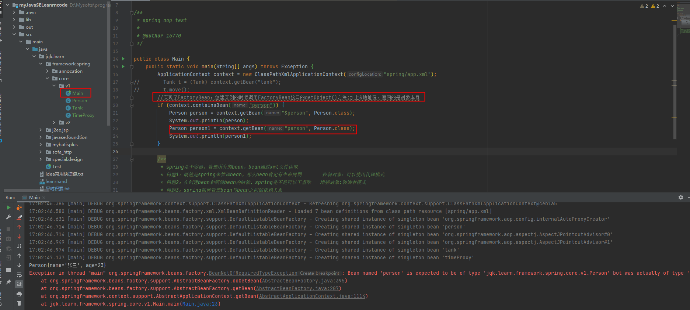

##1:前提条件,图1,2
1.点连成线 线连成面 面成体积
JAVA中的点：java的基础语法
JAVA中的线：JAVA的核心技术
JAVA中的面：各类封装了底层的框架如：SSH,SSM,S2SH,S2SM,SHIRO,ACTIVITY等
JAVA中体积：就是灵活使用各个面搭建一个实体（项目）
2.JAVA与C++和C语言
面向过程：C语言面向过程。主要关注的是数据的流向
面向对象：C++和JAVA都是面向对象。主要关注的是不同对象之间如何交互
JAVA把C++的复杂语法以及手动释放内存以及容易造成编程错误的指针等弊端屏蔽了
3.JAVA运行条件
JDK：JAVA Develop Kit JAVA开发工具
JRE：JAVA Runtime Enviroment JAVA运行环境
JVM：JAVA virtual Machine java虚拟机  跨平台,可移植,JVM也是运行在内存中的,它管理自己的一块内存

## 2:JVM，图3，4,5,6,7,8,9,10,11
1:所有关于类的信息全部保存在方法区，通过常量池来保存。生成了一个代表所有类信息的对象，classinstance
堆区是gc的主要区域，通常情况下分为两个区块年轻代和年老代

对堆内存中开辟的对象的结构进行讲解：
对象由对象的头部信息和实例的信息组成。
对象的内存结构包括 对象头，实例数据，对齐填充

对象头(64位机器占96位)包括：运行时元数据（占64位，8字节），类型指针（占32位，4字节）
运行时元数据包括（Mark Word），非固定的数据结构
1：哈希值 （对象标识hashcode，是一个地址，用于栈对对空间对象的引用指向
2：GC分代年龄 （占4位,最多age=15）,超过15进入老年代。年龄没到15，幸存区满了，大对象或者大年龄进入老年区
3：锁标志状态：1位表示是否偏向锁，2位表示锁标志
类型指针：是对方法区中类元信息的引用,虚拟机通过这个指针来确定该对象是哪个类的实例,指向方法区
实例数据：真实记录一个对象包含的数据,即程序代码中所定义的各种类型的字段内容，包括父类继承下来的和子类定义的
对齐填充：填充部分仅起到占位符的作用, 不是必然存在的，原因是HotSpot要求对象起始地址必须是8字节的整数倍。 
        假如不是，就采用对齐填充的方式将其补齐8字节整数倍，原因是64位机器能被8整除的效率是最高的

clinit是类构造方法
init是构造方法

分配内存出现的问题;
 不管选用哪种方式分配，都将面临线程安全问题。
解决这个问题有两种方案，
一种是对分配内存空间的动作进行同步处理；另一种是把内存分配的动作按照线程划分在不同的空间之中进行，
即每个线程在Java堆中预先分配一块内存，称为本地线程分配缓冲（Thread Local Allocation Buffer，TLAB）。
哪个线程需要分配内存，就在哪个线程的TLAB上分配，只有TLAB用完并分配新的TLAB是，才需要同步锁定。
虚拟机是否使用TLAB可以通过参数配置。

new关键字出现
1：检查符号所在的类是否被加载过
2：为新生对象分配内存：指针碰撞，JAVA堆中内存规整 ；空闲列表 ，不规整
3：将分配的内存空间初始化为零值（不包括对象头）：保证对象实例在不赋初始值就可以使用
4：对对象头进行必要设置
5：执行<init>构造方法

new出一个对象在堆中的布局
1:8个字节的markword
2:在默认的情况下，4个字节的ClassPoint，类型指针，可以找到 .class类
3实例数据instanceData,int类型是4字节，long类型是8字节，没有实例数据的这一块没有，比如new Object
4:对其填充，保证8字节对齐
1：加锁之后，hashcode跑到哪里去了？？
 new对象出来的hashcode如果有调用，是identityHashcode,并不是我们重写的HashCode，存放到对象的markdown中
一旦加锁，hashcode存放到自己的线程栈的lr中，这个lr指向一个数据结构，指向前面用来做备份的markdown中，成为displacedHead
2：如果加了可重入锁，那么会在线程栈再生成一个lr，是空的，解锁的时候弹出，弹完lr锁就解

##3:封装，继承，多态,图12,13，14,15,16,17,18

封装：对一些进行保护，加一层防护，外面的不允许直接访问，提外界访问的出入口
继承：
多态：子类可以代替父类出现，一个对象多种形态

在Java中，重写一个方法记得加@Override注解

查看你字节码文件（在dos命令里）：javap -verbose 类名

实例方法和类方法：
实例方法只能通过对象来访问，（在JVM中调用实例方法是通过局部变量的0号位来使用，表示this，在JVM中如果调用的是实例方法，
那么会在线程栈中的一个栈帧中的局部变量上的0号位放上this这个关键字）

平时在调用private的时候是通过this关键字来调用的，而private方法的信息保存在methodref这张常量表里面，也可以总结出：
JVM中的invokespecial指令是用来调用类的构造器和私有方法的invokevirtual调用实例方法

一个方法在JAVA编译的时候就已经确定了这个方法的描述也就是方法地访问权限和栈深度本地变量个数和参数个数都已经确定好了，
所以我们在调用方法压入栈帧的时候，栈的大小都在java编译时确定好了。

astore_1    把new出来的引用放进1号常量池中
aload_1     再把这个引用放进栈顶
checkcast  用来检验向下转型
ACC_SUPER   :支持父类调用

从父类继承过来的方法，访问权限不能变小，只能扩大。异常只能变小  不可以改用static修饰，但是可以用final修饰

解决异常的时候不要throws Exception抛给上一级,让上一层去try-catch,或者直接try catch 。而是new RuntimeException("异常信息")

##4：集合,图19

写出能最快算出2的多少次方？
答案：通过左移和右移来实现，速度最快，移位运算实在寄存器中进行的而不是在程序中运算的

ArrayLsit的add（）方法
数组最大长度：Integer.MAX_VALUE-8=2的32次方-8
集合初始化时，尽量指定集合初始值大小，默认初始大小是10
ArrayList扩容大小new=old+(old>>1),增长因子是0.5
注意：
ArrayList在初始化的时候最好定义一个初始化数组容量,避免在add操作时消耗cpu,因为数组在进行复制的时候消耗是非常大的,c语言在操作内存

remove（）方法
如果数组中间删除元素，需要进行复制清除算法的进行，删除元素，后面的往前移动
移动算法：
system.arraycopy(    );  底层调用native方法，直接操作内存，c语言写的，速度非常高
LinkedList 底层链表地址不是连续的内存，不类似于数组

jdk1.8之后,接口中可以有实现方法,
Collection接口中有stream()和parallelStream()实现方法
1:方法用default关键字修饰,通过对象调用
2:还可以用static修饰,通过接口名.方法名调用

为什么要这么做?
便于扩展接口中的方法而不破坏原有的继承体系.
如果不这么做,如果想给collection接口的子类都扩展一个steam功能,就必须要重新构造这个继承体系.
我们在面向对象编程中,一定要遵循的法则之一:开闭原则---->对修改封闭对扩展开放.

模板方法

##5:内部类，泛型，线程,图20,21，22,，23,24,25,26,27,28,29

内部类的好处：可以共享所在类的内部中的变量，而不用像访问普通类一样需要把共享的参数传递过去
内部类是如何使用外部类的变量的?

1:非静态内部类(反射)
在Javac也就是编译阶段产生一个访问外部类的一个static的外部类名$内部类名的访问方法,在构造内部类的对象时会默认new一个外部类的对象,然后在new一个
内部类的时候通过构造器将外部类对象传入内部类.这样内部类通过外部类的对象来访问外部类的非成员变量
2:静态内部类
在Javac也就是编译阶段产生一个访问外部类的一个static的外部类名$内部类名的访问方法,然后在静态内部类中通过外部类的类名调用

方法帧有三块：局部变量表  操作数栈  指向常量池的指针

### 锁
> cas的cpu原语cmpxchg是cas的实现原理，lock  避免了线程上下文切换的时间 
>没有涉及到操作系统干涉线程的阻塞和挂起，性能消耗小，但是cas如果竞争激烈，会导致性能下降，直接上锁
>
>wait会是释放锁，sleep不释放锁
>
>偏向锁，第一次进入记住身份，再次进入不需要验证身份了，遇到抢占锁会被挂起（挂起被送到swap分区）
>
>偏向锁--->cas(轻量级，竞争的线程在自旋)------>synchronized(竞争的线程进入阻塞状态)
>
>简单的加锁机制：
>每个锁都有一个请求计数器和一个占有他的线程，当请求计数器为0时，这个锁可以是unhled的
>
>让一个线程退出：
>1：system.exit(),()内传递整数值，当值<0是异常退出，当值>=0是正常运行时退出
>2：线程运行结束
>3:抛出一个异常 
>
>把多个单个线程（具有相同属性）集中管理，叫做线程组--->设计模式之组合模式
>一个线程必须拥有一个组，线程的优先级以及是否为守护线程与父线程相同
>java每个线程中包含父线程德引用，在liunx中所有线程都是由线程fock出来的；有安全管理器

### IO操作

Input/OutPut,Java的IO流就是输入输出.在Java中，流就是二进制，目的地有：内核，用户空间，磁盘，网络
流不是一位一位的进行传输的，通过缓冲区提高速度
FileOutputStream/FileInputStream :从内存到磁盘

spring加载配置文件是如何操作的？  
通过类加载器去加载配置文件，生成一个流，Properties继承了HashTable,存储的是键值对   创建的对象可以加载一个流

计算机之间是通过协议进行沟通的，协议就是一种约定，TCP/IP协议栈，分层，解耦
SOA：
多台机器集群，
服务注册中心，服务注册和查找。
服务检测中心：检测服务的状态。
负载均衡，接收所有的请求。
缓存：解决高速和低速不匹配的状态，可以有一级缓存和二级缓存。

变量：作为容器，有大小，存放数据,容器还可以分类。
java中的char为什么用两个字节存储一个字符？ java使用Unicode编码，utf8是对unicode的实现，延伸了ASCII,两字节编码。 

### 网络编程

Tomcat:  
http://localhost:8080/xxx==http://127.0.0.1:8080/xxx
[ip有很多种比如127.0.0.1这个叫做本地回环IP，255.255.255.255广播地址]   
[localhost:8080:套接字=域名+端口号] new InterSocketAdress(bindAddr,port);

面试问题： 输入一个连接要经历那些步骤？
[键入http://www.baidu.com->DNS解析->通过TCP协议封装数据->
把TCP的报文封装成IP数据报->通过ARP找到下一个要发送的机器的 MAC地址->封装成帧发送]

C/S架构： 其实就是C负责发送请求，S负责响应请求
B/S架构： 浏览器发送请求，S响应请求 0xFFFF:一位16进制由四为二进制
注意：[B/s架构是基于C/S架构的，放大来看，浏览器就是一个进程，服务器也是一个进程，通过TCP进行进程间的互相通讯只不过传输的是html文档]

F：1111 4*4=16; 2^16=65536; [端口号的范围：0<port<65536 一个端口号代表一个进程]
注意：[在计算机中，0-1024内的端口都是给系统备用的，在定义自己的端口的时候要大于1024]
查看那些端口号已经被占用：netstat -an

面试题：编码，字节
为什么在java中能用char来存储一个汉字？
在java中，1个字符=两个字节=16位    在UTF-8中，一个汉字用两个字节表示，有些复杂的用三字节表示

[BIO:阻塞IO，等待接收外部的链接，起到监听的作用]

TCP：可靠的协议： 1：超时重传   2:接收确认  3：滑动窗口避免拥塞(拥塞避免算法)
TCP:这东西是ServerSocket
Tomcat:JSP+Servlet规范的服务器，是一个动态服务器，可以从数据库中找到需要的数据返回浏览器
Apache：就是一个静态服务器，只服务于静态的东西。例如,html，css,js
刚开始web只是用来存储和分享html静态页面，URI：统一资源标识符   
URL：统一资源定位，如http：//www.baidu.com:80/xxx/xxx   通过域名找到服务器，通过端口找到进程，通过请求资源目录找到页面

分布式JAVA EE
RMI：机器之间同步交互
JMS：异步交互
JPA：用来做数据存储
JTS：做分布式事务
JNDI：Java命名目录接口，统一管理组件，相当于注册中心
EJB：JAVA Bean.很复杂
面试题目：[在java中能够向下转型的条件是什么？]   --->必须先发生向上转型

### spring学习及源码分析
在Java中，接口是对行为的高度抽象，说明了要做什么，但是没有说具体的计划
面向对象的设计原则：接口隔离
既然每个接口都是一个功能，那么定义一个接口继承了好几个接口是不是就拥有了多个功能的接口。
所以，如何看源码：
1：看单独接口的功能
2：看组合接口的功能
3：看实现

#### BeanFactory
BeanFactory：可以创建bean实例对象，单例的，多例的，spring2.0的时候，加入了request和session 
提供了最基础的容器查看bean是否存在，保存了bean定义，并且可以根据不同的条件获取bean，查看bean是否是单例的，多例的，获取bean的别名，
有一个&用来获取工厂本身而不是获取bean的实例。
明白了： bean工厂有层级关系。找bean的过程：从子到父。可以给bean指定别名。bean的生命周期
##### 1：bean的生命周期
 * <ol> 初始化顺序 一堆接口->init-method->psotXXX，一切就绪的接口->destroy-method
 * <1>BeanNameAware's {@code setBeanName}
 * <2>BeanClassLoaderAware's {@code setBeanClassLoader}
 * <3>BeanFactoryAware's {@code setBeanFactory}
 * <4>EnvironmentAware's {@code setEnvironment}
 * <5>EmbeddedValueResolverAware's {@code setEmbeddedValueResolver}
 * <6>ResourceLoaderAware's {@code setResourceLoader}
 * (only applicable when running in an application context)
 * <7>ApplicationEventPublisherAware's {@code setApplicationEventPublisher}
 * (only applicable when running in an application context)
 * <8>MessageSourceAware's {@code setMessageSource}
 * (only applicable when running in an application context)
 * <9>ApplicationContextAware's {@code setApplicationContext}
 * (only applicable when running in an application context)
 * <10>ServletContextAware's {@code setServletContext}
 * (only applicable when running in a web application context)
 * <11>{@code postProcessBeforeInitialization} methods of BeanPostProcessors
 * <12>InitializingBean's {@code afterPropertiesSet}
 * <13>a custom init-method definition
 * <14>{@code postProcessAfterInitialization} methods of BeanPostProcessors
 * </ol>

* <ol> 销毁
* <1>{@code postProcessBeforeDestruction} methods of DestructionAwareBeanPostProcessors
* <2>DisposableBean's {@code destroy}
* <3>a custom destroy-method definition
* </ol>
##### 2:取地址符的作用
String FACTORY_BEAN_PREFIX = "&";
实现了FactoryBean，创建实例的时候调用FactoryBean接口的getObject()方法;加上&地址符，返回的是对象本身
加了这个取地址符，返回的是工厂本身实例，而不是工厂创建的实例。

##### 3：实现了FactoryBean的一些方法
FactoryBean：实现了此接口的，就是一个bean工厂,返回的都是Object

#### ListableBeanFactory extends BeanFactory
作用：返回了一系列的bean，根据不同的条件获取，可迭代。
学到了：提供了list特性的bean工厂，可以枚举每一个bean定义，或者获取bean信息或者bean的实例。
##### getBeanDefinitionCount
不考虑父工厂的bean,并且忽略通过bean定义以外的其他方式注册的任何单例bean。

#### HierarchicalBeanFactory extends BeanFactory 
作用：获取父工厂，并且可以查找bean是否存在,忽略了祖先bean工厂中具有给定名称的bean。

#### EnvironmentCapable
作用：配置工厂环境
 

#### MessageSource
作用：解析消息

#### ApplicationEventPublisher
观察者模式：监听事件，通知观察者，进行时间回调

#### ResourceLoader
作用：加载资源

#### ApplicationContext  extends EnvironmentCapable, ListableBeanFactory, HierarchicalBeanFactory, MessageSource, ApplicationEventPublisher, ResourcePatternResolver

